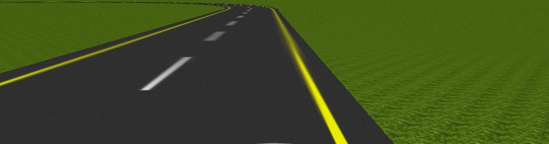
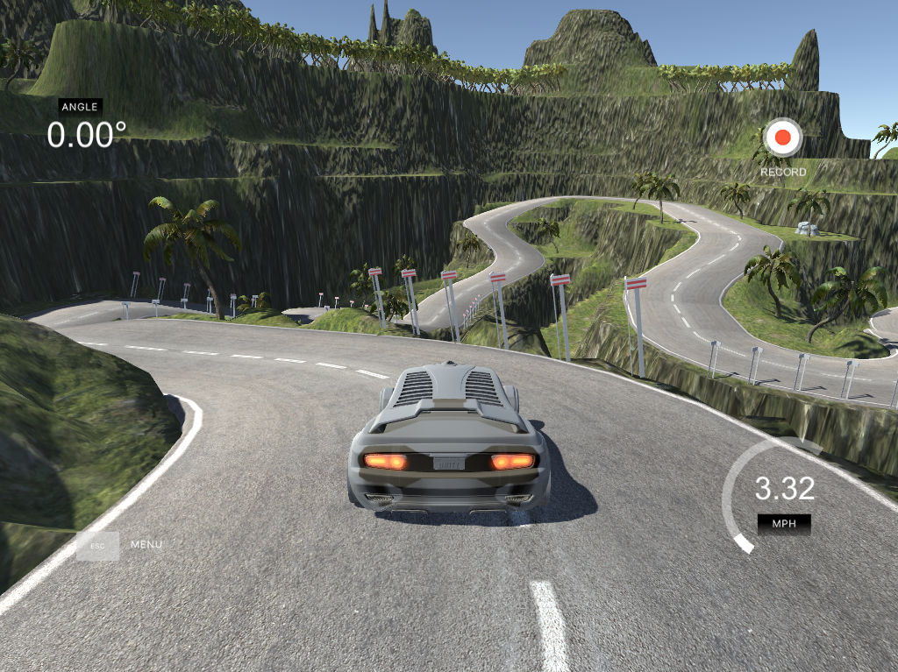

# A-Comparative-Study-on-End-to-End-Models-for-Self-Driving-Cars

We have evaluated 6 different deep learning based models in the domain of end-to-end self driving vehicle system on 4 different datasets.

## Dataset

1. Real world dataset  


2. Carla dataset  


3. Oscar dataset


4. Unity dataset


## Setup

### Clone the repository

``` bash
git clone https://github.com/atanuc13/A-Comparative-Study-on-End-to-End-Models-for-Self-Driving-Cars.git

cd A-Comparative-Study-on-End-to-End-Models-for-Self-Driving-Cars
```

### Create a conda environment and activate it
``` bash
conda create -n selfDriving python=3.8 -y
conda activate selfDriving
```

### Install pip dependencies
``` bash
pip3 install -r requirements.txt
```

## Performance Analysis
The performance is evaluated in terms of Means Square
Error(MSE). We have conducted these experiments twice, once at 40 epochs and another on
100 epochs

1. at 40 epochs


2. at 100 epochs


Our experimental results demonstrated
that the VGG19 and RESNET50 models achieved the best performance, indicating
its superiority for self-driving car applications.